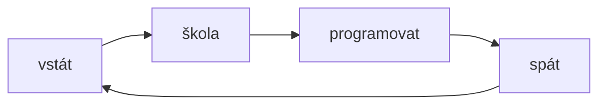

# Vítej 
Vítejte na mé stránce pomocí mkdocs. Nic moc tu není, tak hodně štestí něco tu najít :).

## Commands

* `Dobře možná tu najdete` 
* `hrátky s commandy` 
* `System.out.println("C0d1ng i5 my C4rd10")` 

nebo grafy

