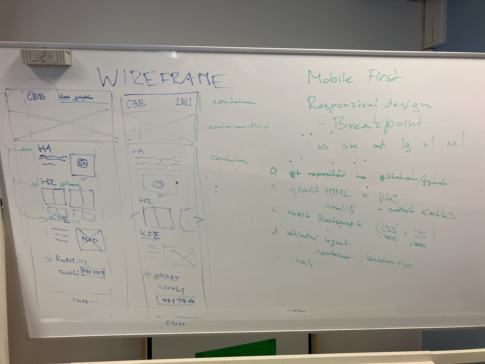

# WA-hodina 5. 1.

## Shrnutí
 - na hodině jsme probírali WIREFRAME 
 - vysvětlili jsme si proč je důležité vztvářet webovou aplikaci pro mobil
 - naučilil jsme se jak využít `class=container`
 - breakpoints `xs`, `sm`, `md`, `lg`, `xl`, `xxl`  
 - příprava na písemku - např. změnit `<title>`